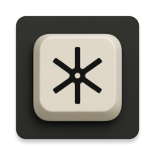

# Essential Keyboard

### *The missing piece in Nothing's AI ecosystem*

---

## Nothing Built a Second Brain

Essential Space changed how we capture information. Screenshots get transcribed. Voice notes get summarized. Calls become searchable text. Everything organized, everything remembered.

But there's been a gap.

**You can capture context. You can search it. But when you're staring at a blank reply field, you're still on your own.**

Until now.

---

## Introducing Essential Keyboard



An AI-powered keyboard that completes the Essential loop.

**Capture → Organize → Search → *Compose***

Essential Keyboard sits at the output layer. It takes everything Essential Space remembers and puts it to work—drafting messages, composing replies, turning your spoken thoughts into polished text.

All on-device. All private. All *essential*.

---

## Three Features. One Flow.

### 🎙️ Voice Dictation
Ditch the keyboard. Hold **Transcribe**, speak naturally, release.

On-device Whisper-powered STT delivers instant, accurate transcription. No network round-trip. No cloud processing.

*Essential Space records your world. Essential Keyboard records your words.*

---

### 👁️ Context Catcher
Smart Context Awareness that actually works.

Essential Keyboard reads the conversation. It sees what's on screen. When you ask it to draft something, it understands *where* you are and *what* you're responding to.

No more pasting context into prompts. No more "based on the above..." gymnastics.

*Essential Space organizes your memories. Essential Keybaord applies them in real-time.*

---

### 🧠 Smart Recall
Memory-Powered Responses that sound like you.

This is the integration that matters. Essential Keybaord pulls from your personal context—past messages, notes, captured information—to draft replies that are informed, accurate, and unmistakably *yours*.

*Essential Space is your second brain. Essential Keybaord is how it speaks.*

---

## The Ecosystem Complete

| Layer | Nothing Essential | Essential Keybaord |
|-------|-------------------|----------|
| **Input** | Screenshots, voice notes, calls | Your voice commands |
| **Processing** | AI transcription &amp; summarization | On-device STT &amp; LLM |
| **Storage** | Organized collections | Personal memory access |
| **Output** | Search &amp; retrieval | **Composed text in any app** |

The Essential Key is your capture button.
**Essential Keybaord is your compose button.**

---

## Get Started

### Requirements
- Android device (API 28+)
- Android Studio (latest stable)
- JDK 11+

### Build
```sh
./gradlew assembleDebug
./gradlew installDebug
```

### Enable
**Settings → System → Languages &amp; input → On-screen keyboard → Manage → Enable Essential Keybaord**

Or use the in-app shortcut.

### Configure
Open Essential Keybaord app:
- **Voice Models** tab → Download STT model
- **LM Models** tab → Download language model

First launch initializes your selected models on-device.

---

## How to Use

| Action | Result |
|--------|--------|
| Hold **Transcribe** + speak + release | Voice transcribed to text |
| Hold **AI Draft** + speak instruction + release | LLM streams contextual draft |
| Tap **123/ABC** | Toggle number/letter layout |
| **Shift** | Auto-capitalizes intelligently |
| Toggle **Context Awareness** | Makes the LLM contextually aware of whats on your screen |

---

## Under the Hood

```
┌─────────────────────────────────────────────────────────────┐
│                     PeyoKeysService                         │
│                   (InputMethodService)                      │
│   QWERTY/Numeric Layouts · Mic Handling · Stream Insertion  │
└──────────┬─────────────────────┬─────────────────┬──────────┘
           │                     │                 │
           ▼                     ▼                 ▼
┌──────────────────┐  ┌──────────────────┐  ┌──────────────────┐
│ScreenReaderService│  │SystemPromptService│  │MemoryReaderService│
│   (Accessibility) │  │  (LLM Tuning)    │  │     (RAG)        │
│                   │  │                  │  │                  │
│ Reads screen      │  │ Finetunes LLM    │  │ Queries Essential│
│ context in        │  │ behavior for     │  │ Space memories   │
│ real-time         │  │ better task      │  │ for personalized │
│                   │  │ performance      │  │ context          │
└────────┬──────────┘  └────────┬─────────┘  └────────┬─────────┘
         │                      │                     │
         └──────────────────────┼─────────────────────┘
                                ▼
              ┌─────────────────────────────────┐
              │     Cactus SDK (On-Device)      │
              │  ┌──────────┐   ┌──────────┐    │
              │  │CactusSTT │   │ CactusLM │    │
              │  │(Whisper) │   │  (Local) │    │
              │  └──────────┘   └──────────┘    │
              └─────────────────────────────────┘
```

**100% on-device inference.** Three specialized services power the magic:
- **ScreenReaderService** – Accessibility-powered screen context awareness
- **SystemPromptService** – Dynamic prompt tuning for task-specific LLM behavior  
- **MemoryReaderService** – RAG pipeline into Nothing's Essential Space memories

---

## Project Structure
```
app/
├── src/main/java/com/cactus/peyokeys/
│   ├── PeyoKeysService.kt        # IME core
│   ├── ScreenReaderService.kt    # Accessibility-based context capture
│   ├── SystemPromptService.kt    # LLM task tuning
│   ├── MemoryReaderService.kt    # RAG for Essential Space
│   └── MainActivity.kt           # Model manager UI
├── src/main/res/layout/
│   ├── keyboard.xml
│   └── keyboard_numbers.xml
└── AndroidManifest.xml
```

---

## Permissions
- **RECORD_AUDIO** – Voice input (requested on first use)
- **INTERNET** – Model downloads only
- **ACCESSIBILITY** - Reads the screen

---

## Built For Nothing

Essential Space captures your digital life.
Essential Key triggers your second brain.

**Essential Keyboard puts it all into words.**

---

*Voice + AI keyboard for Android*
*Powered by [Cactus SDK](https://cactuscompute.com)*
